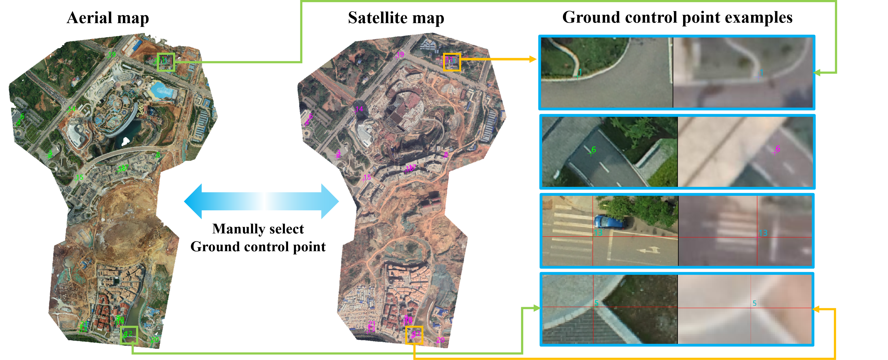
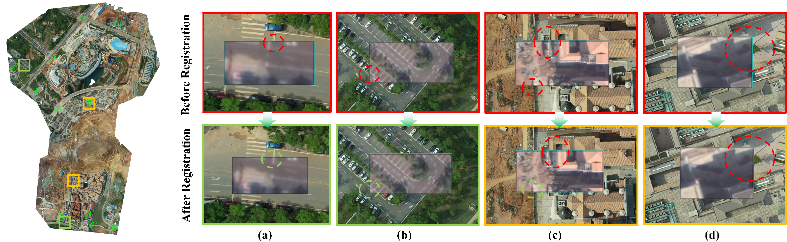

# Ground Truth and Alignment

This document describes how the AnyVisLoc pose ground truth and reference maps were prepared. The released data are intended for <strong>horizontal UAV visual localization in a scene-local coordinate system</strong>.

## UAV Images and Aerial Reference Maps

The original UAV poses were obtained from two sources. Part of the UAV images was collected with <strong>Real-Time Kinematic Global Positioning System (RTK GPS)</strong>, providing centimeter-level positioning accuracy. The remaining images used standard <strong>GPS</strong>, whose error is generally within approximately <strong>10 m</strong>; within one flight, however, the systematic bias is usually similar across images.

Since raw GPS positions may contain non-negligible errors, especially for standard GPS flights, we use an aerial-photogrammetry workflow based on <strong>Structure from Motion (SfM)</strong> to improve the relative accuracy between UAV images and aerial reference maps. Specifically, we refine all camera poses and intrinsics, reconstruct a 3D model from dense inter-image correspondences, and then generate the aerial orthomosaic and its <strong>Digital Surface Model (DSM)</strong> by orthographic projection. In this way, the final UAV poses, aerial reference map (orthomosaic) and aerial DSM are constructed in a consistent local geometry, rather than relying only on the raw GPS measurements.

To verify this relative geometric relationship, we manually selected corresponding points between UAV images and aerial reference maps and solved the <strong>Perspective-n-Point (PnP)</strong> problem. The resulting error was within <strong>0.5 m</strong>. Considering the uncertainty associated with manual point selection and the decimeter-level resolution of the DSM, we regard the released UAV pose ground truth as sufficiently accurate and appropriate for localization evaluation, particularly for success-rate thresholds of <strong>3 m, 5 m, and 10 m</strong>.

Although most regions in the aerial reference maps are well reconstructed, some local areas still exhibit distortion, blur, or ghosting around buildings, as shown in Figure 1. These artifacts are difficult to avoid in large and complex urban scenes, where the reconstruction images cannot fully cover all viewing directions and some data were collected years apart. Such imperfections can therefore be viewed as <strong>practical challenges</strong> for high-precision UAV visual localization using aerial reference maps, as well as <strong>valuable directions</strong> for future research.

  

  <em>Figure 1. Examples of well constructed regions and some minor artifacts in aerial reference maps.</em>

## UAV Images and Satellite Reference Maps

For the satellite-reference setting, directly matching UAV images to satellite images for ground-truth correction is not practical because of the large differences in viewpoint, scale, appearance, and occlusion. Instead, since the UAV images have already been accurately aligned with the aerial reference maps, we use the aerial reference maps as an intermediate bridge to improve the satellite-reference alignment.

Specifically, we manually selected ground control points between the aerial and satellite reference maps using professional remote-sensing software, as illustrated in Figure 2. We then warped each satellite reference map to the aerial reference map to correct its overall geographic offset and reduce the coordinate discrepancy between the satellite reference and UAV poses.

  

  <em>Figure 2. Illustration of manual ground control point selection between the aerial reference map and the satellite reference map for satellite-to-aerial warping.</em>

After manual inspection, the mean relative error between the warped satellite map and the aerial reference map is within <strong>1 m</strong>, as shown in Figures 3a and 3b. However, the error can exceed 1 m in a small number of regions, mainly because the original satellite imagery may contain local georeferencing distortions, especially in rapidly changing urban areas, as shown in Figure 3d. In addition, satellite images are not perfectly orthorectified. Although we carefully selected near-nadir historical imagery from Google Earth, buildings may still show a leaning effect, as shown in Figure 3c. Therefore, when selecting control points, we mainly use roads and other areas with approximately consistent elevation, rather than building roofs, so that the warped satellite imagery is well aligned with the aerial reference map in these stable ground regions.

The public satellite DSM has a coarse resolution of <strong>30 m</strong>, which is much larger than the typical offset between the satellite and aerial reference maps. Therefore, we do not further correct the geographic coordinates of the satellite DSM. These remaining factors, including local satellite distortion, non-orthorectified building lean, and coarse DSM resolution, represent realistic engineering challenges for low-altitude UAV visual localization with satellite references and provide meaningful directions for future research.

  

  <em>Figure 3. Satellite-to-aerial alignment. (a–b) Representative well-aligned areas; (c) building lean caused by non-orthorectified satellite imagery; (d) an example of local residual distortion.</em>

## Coordinate Sanitization and Recommended Use

To protect the geographic privacy of the data-collection sites, we use the upper-left geographic coordinate of the aerial reference map as the origin of a new local coordinate system. Original UAV longitude and latitude values are first converted into <strong>Universal Transverse Mercator (UTM)</strong> coordinates and then transformed into the local metric coordinate system. Meanwhile, UAV heights and DSM elevations are shifted by subtracting the mean elevation of the original DSM.

> 
<strong>Important: Do not use AnyVisLoc to benchmark UAV height estimation or absolute-altitude estimation.</strong>

Because the original UAV images do not share a consistent elevation reference, and the released coordinates are intentionally sanitized, AnyVisLoc is designed for <strong>horizontal visual localization</strong>, not vertical localization.

Overall, we have corrected the main avoidable sources of relative pose and reference-map misalignment through <strong>SfM-based aerial reconstruction, manual PnP verification, and satellite-to-aerial control-point warping</strong>. The remaining imperfections do exist, but they also reflect practical engineering problems that need to be addressed, such as how to achieve robust UAV localization when reference maps contain local distortions or other unavoidable artifacts. These issues provide meaningful directions for future research. Researchers interested in further improving the ground truth are welcome to contact us.

